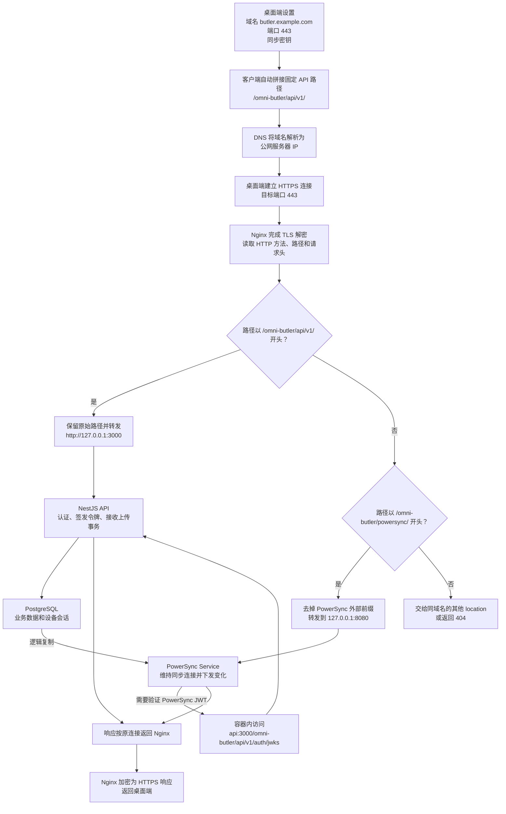

# Docker Compose 部署

在 `deploy/` 目录执行以下命令。Compose 会统一管理 PostgreSQL、API、PowerSync 的网络、数据卷、启动顺序和健康检查。

## 准备

安装 Docker 和 Compose 插件。首次部署将 `.env.example` 复制为 `.env`（PowerShell 使用 `Copy-Item .env.example .env`，CMD 使用 `copy .env.example .env`，Bash 使用 `cp .env.example .env`），已有 `.env` 时直接编辑，不要覆盖。

配置统一填写在 `.env` 中：

| 配置 | 用途 |
| --- | --- |
| `POSTGRES_PASSWORD` | 数据库密码，使用较长的随机字母数字串 |
| `SYNC_SECRET` | 客户端连接密钥，至少 16 个字符 |
| `API_HOST_PORT` | API 的宿主机映射端口，默认 `3000` |
| `POWERSYNC_HOST_PORT` | PowerSync 的宿主机映射端口，默认 `8080` |
| `POWERSYNC_PUBLIC_URL` | 客户端访问的同步地址；公网示例为 `https://butler.example.com/omni-butler/powersync/` |

Compose 自动读取当前目录的 `.env`，容器内部端口固定为 `3000`、`8080`。已有 `.env` 时补上 `API_HOST_PORT=3000`、`POWERSYNC_HOST_PORT=8080`，或填写自己的映射端口。

API 和 PowerSync 的公网路径固定为 `/omni-butler/api/v1/`、`/omni-butler/powersync/`，不需要也不能通过 `.env` 或客户端设置修改。

## 启动

配置完成后，Windows PowerShell、CMD 和 Linux / macOS 均使用同一条命令：

```text
docker compose up -d --build --wait
```

局域网直连时，例如在 `.env` 中将两个端口分别改为 `9000`、`9080`，客户端端口填写 `9000`，`POWERSYNC_PUBLIC_URL` 改为 `http://<服务器IP>:9080`。端口映射不会自动修改对外 URL。公网部署先按下面的 Nginx 章节调整 `.env`。

如果之前在终端设置过同名端口变量，请清除它们或打开一个未设置这些变量的新终端；终端环境变量的优先级高于 `.env`。

## 公网部署：Nginx + HTTPS

使用一个域名访问 API 和 PowerSync，Nginx 直接安装在 Docker 所在的 Linux 宿主机上。

- 将 `butler.example.com` 替换为自己的域名，并解析到服务器公网 IP。
- 安装 Nginx，提前签发有效证书，准备完整证书链和私钥。
- 在服务器安全组和防火墙中允许访问 `80`、`443`。

在 `.env` 中确认或修改以下三项：

```dotenv
API_HOST_PORT=127.0.0.1:3000
POWERSYNC_HOST_PORT=127.0.0.1:8080
POWERSYNC_PUBLIC_URL=https://butler.example.com/omni-butler/powersync/
```

端口配置支持 `监听地址:端口` 格式。上述配置将后端端口绑定到宿主机回环地址，公网请求统一经过 Nginx。保存后执行同一条 `docker compose up -d --build --wait`。

### Nginx 配置

将以下内容保存到 `/etc/nginx/conf.d/omni-butler.conf`，确认该目录由 `nginx.conf` 的 `http` 块加载。替换域名和证书路径；示例证书路径不会自动生成证书。

API 和 PowerSync 分别固定使用 `/omni-butler/api/v1/`、`/omni-butler/powersync/`。两个前缀互不重叠，也不会占用当前域名的根路径，方便同一台 Nginx 继续部署其他服务。公网部署时，`POWERSYNC_PUBLIC_URL` 必须使用这里固定的 PowerSync 路径并保留末尾 `/`。

```nginx
# 按请求决定是否升级为 WebSocket。
map $http_upgrade $omni_connection_upgrade {
    default upgrade;
    ''      close;
}

server {
    listen 80;
    server_name butler.example.com;

    return 308 https://butler.example.com$request_uri;
}

server {
    listen 443 ssl;
    server_name butler.example.com;

    # 替换为实际证书链和私钥文件。
    ssl_certificate     /etc/letsencrypt/live/butler.example.com/fullchain.pem;
    ssl_certificate_key /etc/letsencrypt/live/butler.example.com/privkey.pem;
    ssl_protocols TLSv1.2 TLSv1.3;

    # 与后端允许的上传大小一致。
    client_max_body_size 32m;

    proxy_http_version 1.1;
    proxy_set_header Host $host;
    proxy_set_header X-Real-IP $remote_addr;
    proxy_set_header X-Forwarded-For $proxy_add_x_forwarded_for;
    proxy_set_header X-Forwarded-Proto $scheme;
    proxy_set_header Upgrade $http_upgrade;
    proxy_set_header Connection $omni_connection_upgrade;

    # API：保留客户端已经拼接的完整接口路径。
    location ^~ /omni-butler/api/v1/ {
        proxy_pass http://127.0.0.1:3000;
    }

    # PowerSync 基础路径缺少末尾斜杠时，保留请求方法并补上斜杠。
    location = /omni-butler/powersync {
        return 308 /omni-butler/powersync/;
    }

    # PowerSync：去掉外部路径前缀后转发，并关闭响应缓冲。
    location ^~ /omni-butler/powersync/ {
        proxy_pass http://127.0.0.1:8080/;
        proxy_buffering off;
        proxy_cache off;
        proxy_read_timeout 3600s;
        proxy_send_timeout 3600s;
    }
}
```

API 的 `proxy_pass` 后没有 URI，因此完整 API 路径会原样交给 NestJS。PowerSync 的 `proxy_pass` 末尾必须保留 `/`，Nginx 才会把外部 `/omni-butler/powersync/` 替换成容器能够识别的根路径 `/`。未匹配这两个前缀的请求不会进入 Omni Butler，可继续由其他 `location` 处理；没有其他匹配时由 Nginx 返回默认响应。若修改了后端映射端口，也要修改对应的 `proxy_pass` 端口。Nginx 若运行在另一个容器里，`127.0.0.1` 指向 Nginx 容器自身，不能直接照用此配置。

### 桌面端如何访问公网服务

桌面端设置只填写以下三项，API 路径由应用自动拼接：

| 输入项 | 填写内容 |
| --- | --- |
| 服务器地址 | `butler.example.com` |
| 端口 | `443` |
| 同步密钥 | 与服务器 `.env` 中的 `SYNC_SECRET` 一致 |

公网域名默认使用 HTTPS，因此客户端会拼出 API 根地址 `https://butler.example.com:443/omni-butler/api/v1`；HTTPS 默认端口为 `443`，URL 中也可以省略。客户端不会直接访问公网的 `3000` 或 `8080`；这两个端口只允许同一台服务器上的 Nginx 访问。

| 网络入口 | 谁访问 | 作用 |
| --- | --- | --- |
| 公网 `443` | 桌面端 | 唯一的 HTTPS 业务入口，由 Nginx 监听 |
| 公网 `80` | 浏览器或误用 HTTP 的客户端 | Nginx 返回 `308`，要求改用 HTTPS；正常桌面端连接不需要先访问它 |
| `127.0.0.1:3000` | 服务器本机的 Nginx | Docker 映射到 API 容器的 `3000` |
| `127.0.0.1:8080` | 服务器本机的 Nginx | Docker 映射到 PowerSync 容器的 `8080` |



一次首次连接和后续同步大致经过以下步骤：

1. 客户端向 `POST https://butler.example.com/omni-butler/api/v1/auth/connect` 发送同步密钥。Nginx 匹配 API 专用 `location`，把原始路径转发到 `127.0.0.1:3000`。
2. API 校验密钥、在 PostgreSQL 中创建该设备的会话，返回短期访问令牌和设备凭证。
3. 客户端携带访问令牌请求 `POST /omni-butler/api/v1/auth/powersync-token`。API 返回 PowerSync 短期 JWT，以及 `.env` 中的 `POWERSYNC_PUBLIC_URL`，本例为 `https://butler.example.com/omni-butler/powersync/`。
4. PowerSync SDK 在这个地址后追加 `sync/stream` 等协议路径。Nginx 匹配 `/omni-butler/powersync/`，去掉外部前缀，再把 `/sync/stream` 转发到 `127.0.0.1:8080`。
5. PowerSync 从 PostgreSQL 的逻辑复制流获得服务端变化并下发。桌面端的本地修改则由客户端整理成事务，再通过 `POST /omni-butler/api/v1/sync/operations` 上传给 API，最终写入 PostgreSQL。

同步密钥只在首次连接时通过 HTTPS 请求体发送。建立会话后，普通 API 请求改用短期 Bearer Token；设备凭证只用于刷新令牌或断开会话。

Nginx 的分流依据是 URL 路径：`/omni-butler/api/v1/` 交给 API，`/omni-butler/powersync/` 交给 PowerSync，其他路径留给同域名上的其他服务。它不会解析请求 JSON 来选择服务。`Host`、`X-Real-IP`、`X-Forwarded-For`、`X-Forwarded-Proto` 等请求头也会一并传递。

首次连接请求的 HTTP 格式如下，JSON 中的密钥仅为示意：

```http
POST /omni-butler/api/v1/auth/connect HTTP/1.1
Host: butler.example.com
Content-Type: application/json

{
  "syncKey": "替换为服务器配置的同步密钥"
}
```

认证成功后的 API 请求使用 Bearer Token，例如获取 PowerSync 凭证：

```http
POST /omni-butler/api/v1/auth/powersync-token HTTP/1.1
Host: butler.example.com
Authorization: Bearer <accessToken>
Content-Length: 0
```

本地数据变更以一个完整事务上传，格式示例如下：

```http
POST /omni-butler/api/v1/sync/operations HTTP/1.1
Host: butler.example.com
Authorization: Bearer <accessToken>
Content-Type: application/json

{
  "clientId": "客户端数据库安装 UUID",
  "transactionId": "本地事务 ID",
  "operations": [
    {
      "op": "PATCH",
      "table": "todo_items",
      "id": "待办记录 UUID",
      "data": {
        "title": "修改后的标题"
      }
    }
  ]
}
```

这两个路径是服务协议的一部分，请保持 Nginx 配置不变。公网部署只需将示例域名替换为自己的域名，并确保 `POWERSYNC_PUBLIC_URL` 以 `/omni-butler/powersync/` 结尾。

检查并加载配置（使用 systemd 的 Linux）：

```bash
sudo nginx -t && sudo systemctl reload nginx
```

验证两个服务的公网入口：

```bash
curl -f https://butler.example.com/omni-butler/api/v1/health
curl -f https://butler.example.com/omni-butler/powersync/probes/liveness
```

证书到期前需要续期并重新加载 Nginx。配置指令可查阅 [Nginx HTTPS](https://nginx.org/en/docs/http/configuring_https_servers.html)、[反向代理](https://nginx.org/en/docs/http/ngx_http_proxy_module.html)及 [WebSocket](https://nginx.org/en/docs/http/websocket.html) 官方文档。

## 客户端连接

在设置中开启“多端数据同步”：

| 输入项 | 局域网示例 | 上述 Nginx 公网示例 |
| --- | --- | --- |
| 服务器地址 | `192.168.1.10` | `butler.example.com` |
| 端口 | `3000` | `443` |
| 同步密钥 | `.env` 中的 `SYNC_SECRET` | `.env` 中的 `SYNC_SECRET` |

地址栏只填写 IP 或域名，端口单独填写。客户端会自动拼接固定 API 路径 `/omni-butler/api/v1/`；局域网 IP 默认 HTTP，公网地址默认 HTTPS，局域网也使用 HTTPS 时可填写 `https://192.168.1.10`。PowerSync 完整地址由后端下发，用户无需填写同步路径。

## 查看、停止与更新

查看状态和日志：

```text
docker compose ps
docker compose logs -f api powersync
```

停止实例，保留容器和数据：

```text
docker compose stop
```

重新启动、更新代码或修改 `.env` 后，执行 `docker compose up -d --build --wait`。Compose 会重新读取配置、构建镜像并按需重建容器，数据卷保留；更改已初始化数据库的密码还必须修改数据库内的角色密码，仅修改 `.env` 不会生效。

## 数据与备份

业务库和同步状态保存在 `postgres-data` 卷，签名私钥保存在 `api-keys` 卷。实际卷名带 Compose 项目前缀；保持部署目录和项目名不变，不要使用 `docker compose down -v` 删除数据卷。

单独备份业务库和私钥（Bash）：

```bash
docker compose exec -T postgres pg_dump -U omni_butler omni_butler > backup.sql
docker compose cp api:/app/keys ./api-keys-backup
```

API 文档：局域网为 `http://<服务器IP>:<API端口>/omni-butler/api/v1/docs`，上述公网部署为 `https://butler.example.com/omni-butler/api/v1/docs`。接口细节见 [服务端说明](../apps/server/README.md)。
